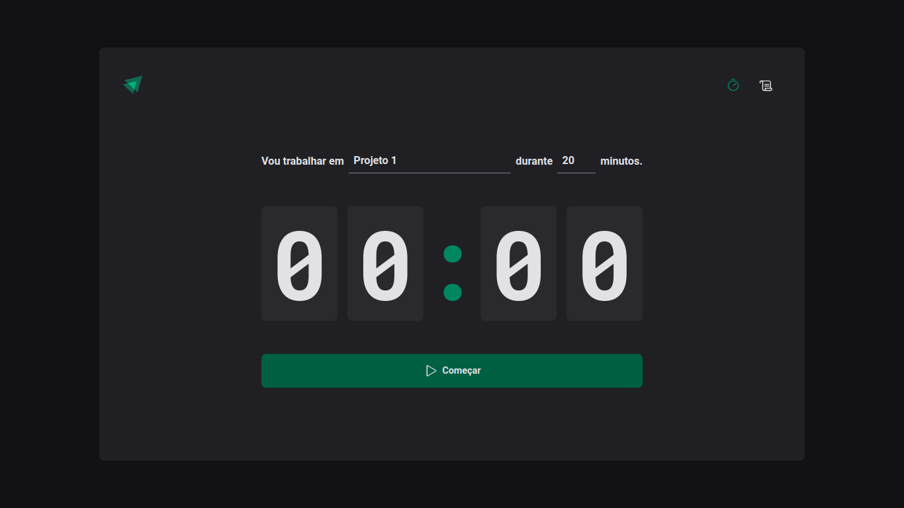
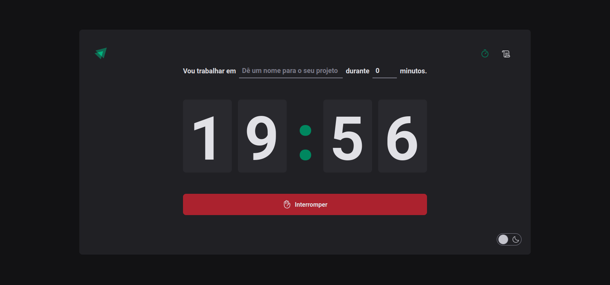
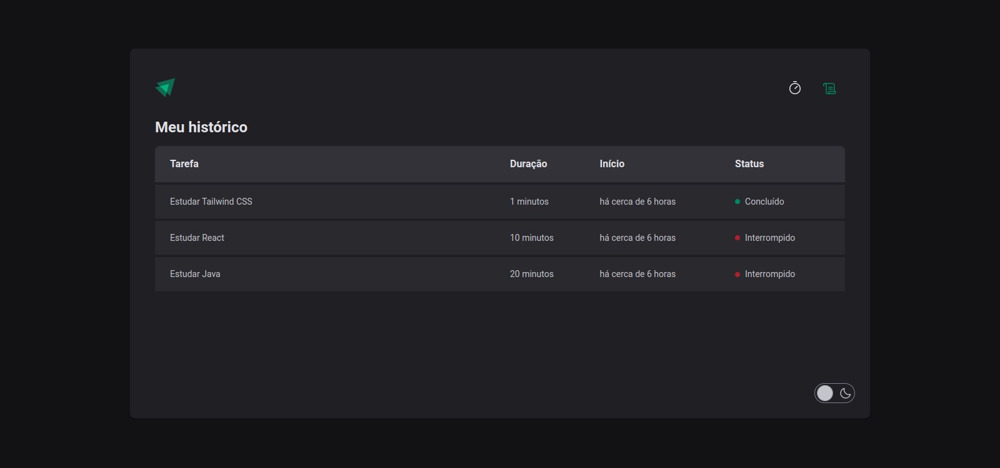

# ignite-feed

Projeto realizado para solidificar conceitos como, useReducer, context API e Local Storage.

### 🎨 Layout Web

<p align="center">
   
   
   
</p>

### Pré-requisitos

Antes de começar, você vai precisar ter instalado em sua máquina as seguintes ferramentas:
[Git](https://git-scm.com) e [Node.js](https://nodejs.org/en/). 
Além disto é recomendado ter um editor para trabalhar com o código como [VSCode](https://code.visualstudio.com/).

#### 🎲 Rodando o app

```bash

# Clone este repositório
$ git clone git@github.com:JoaoManoelDev/timer.git

# Acesse a pasta do projeto no terminal/cmd
$ cd timer

# Instale as dependências
$ npm instal

# Execute a aplicação em modo de desenvolvimento
$ npm run dev

# O servidor inciará na porta:3000 - acesse http://localhost:3000

```

Feito com ❤️ por João Manoel
